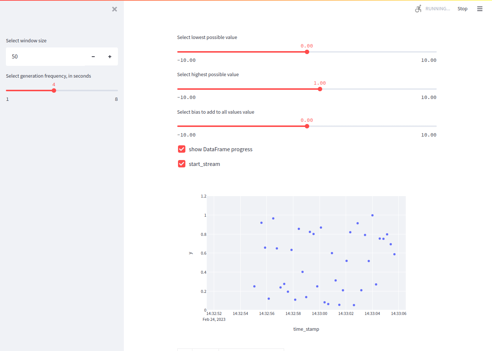

# Title: 
Streaming Data Synthesizer
  
# Description:
this app is used to visually explore how streaming data could appear on a monitoring application

## MVP
+ random normal distribution
	+ frequency (per milisecond) toggle
	+ intercept toggle

## first iteration

